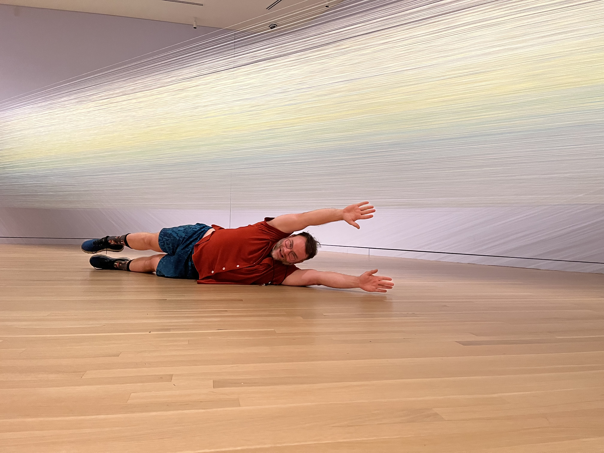
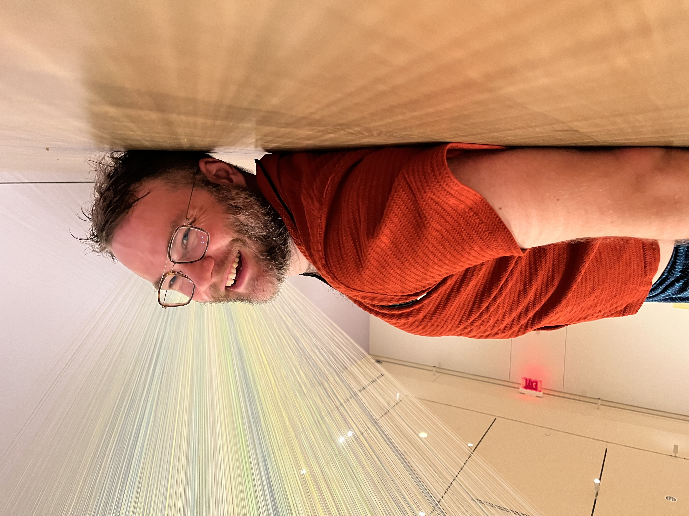

[Anne Lindberg](https://www.annelindberg.com/) was born in 1962, works in Ancramdale, New York, and makes art using many materials, with a focus on paint and thread. This piece is made from thread and staples in response to an essay by Patrik Reuterswärd about how color can approximate the divine plane peeking into our world.

I saw the work at [The Textile Museum](https://museum.gwu.edu/) in Washington, DC. One of the appeals of textile art is flexibility. The material lives on our bodies and moves, sweats, and decays along with us. Here, the dynmaic is reversed, the thread is tightly bound and the viewer's movement generates flexiblity and visual dymanism.

The threads are stapled between two corners. Some threads are tied in a loop, others tied directly to staples. Densely packed, the viewer can approach and have their vision occupied by a field of multi-color strands. As your eyes move, the threads slide in and out of view and shadow and the color shifts as though cast by water.

The best way to experience a divine light is flat on your back. Lying down and looking up at the piece while jiggling slightly was a memorable and joyous experience in my life.

I love thread art, and this was a wonderful piece. With planning it can be cheaply recreated in a home, so I suspect these streched thread designs will have a trendy moment in the coming decades, though it will take thought to make them easy to clean.

## More Information:

- [Anne Lindberg's book](https://www.durereditions.com/products/anne-lindberg)
- [Anne Lidberg's Instagram](https://www.instagram.com/annelindbergstudio/)
- [Exhibition Gallery Guide](https://issuu.com/textile_museum/docs/anne_lindberg_gallery_guide)
- [Exhibition video interview](https://vimeo.com/830647166)