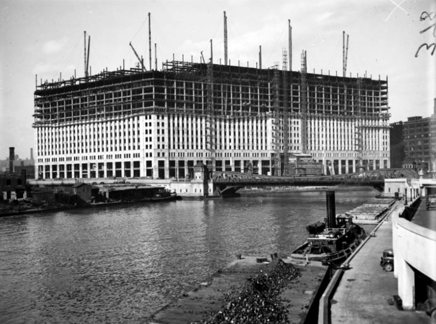
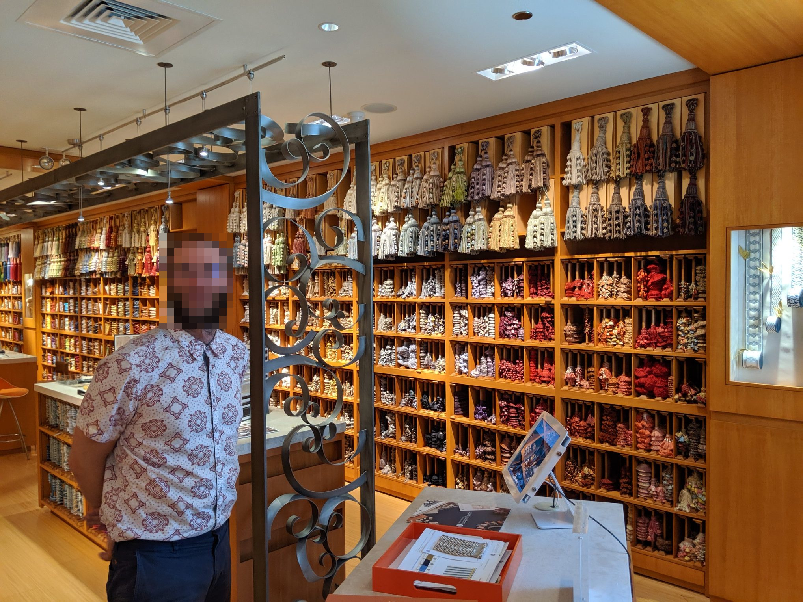
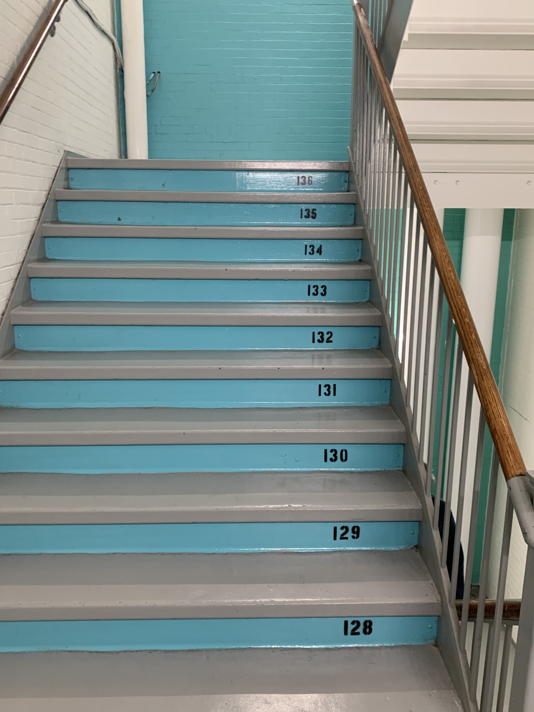

The Merchandise Mart was the world's largest building when it opened in 1930. The first building with its own zip code was originally designed to centralize all 13 Marshall Field and Company warehouses in Chicago. It opened 6 months into the Great Depression and immediately started losing millions of dollars a year. 

The American wholesale industry was already losing ground to urban retailers empowered by easy rail transportation and Marshall Field quickly gave up their warehouse space, though the Mart's focus on home furnishings still survives.

The Pentagon stole the title of world's largest building in 1943 while the Mart was occupied housing wartime government administration. In 1945 the building was sold to Joseph P. Kennedy, the 35th president's father. 

He built the brand, starting public tours and creating a merchant's hall of fame by installing 8 bronze busts along the Chicago River. During the 40s and 50s, the Mart was the largest host of trade shows in America and a major source of the Kennedy's wealth until their sale of the building in 1998.

The success of the Mart spurred the construction of the associated Chicago Apparel Center (now called 350 North Orleans) in 1977. In 1988, the buildings were physically connected by an elevated walkway over Orleans Street. In the early 90s, the first two floors were renovated to capture the attention of growing residential populations in the North Loop.

The Chicago Riverwalk now traces the opposite bank of the river, and the Mart has taken advantage on the spotlight by installing a 2.5 acre projector. Every night an art focused video dances across the broad south face of the building.

## Architecture

The lowest floors of the Merchandise Mart are delightful. The exterior corners of the building are sliced off (chamfered) and mirror the slant of Orleans Street. The lines of the exterior run skyward, working with the smaller top floors to gently reduce the width of the building. Inside, soaring ceilings are split down the middle by an elevator bank featuring stunning brass Art Deco designs. The South Lobby has two stories of stadium seating, a perfect spot for enjoying lunch and people watching. 

## My Favorite Building
The building is a delight because it's public in a way that has mostly vanished from modern life. You can freely walk up and down staircases, there are public bathrooms on every floor, and very few off limit areas. I've explored extensively, and these are my favorite moments.

### What A Bargain
After the first two floors, the building is quiet and unimpressive; shorter ceilings, inoffensive carpet designed to hide stains, and white walls forever rearranged as tenants come and go. On occasion, the Mart erupts with trade show activity. [NeoCon](https://neocon.com) is the largest, transforming wide hallways into jostling scrums. After the show recedes, retailers start a new season, dragging their out of fashion furniture into the hallway, where it's priced with taped on scraps of paper and The Mart briefly becomes the best place in Chicago to get a once in a lifetime bargain on barely used office furniture.

### Tassels For Days
If you like looking at expensive things, there are a hundred of delightful stores scattered through the Mart. The Kholer store used to have a device for measuring the electrical capacitance of the human body. I could touch a sink and see a graph of every picofarad stuck to me. That's been uninstalled, but the tassel store still stands strong.

[Samuel & Sons](https://samuelandsons.com/) sits patiently on the 6th floor, like a pinata full of tassels. The building's quiet hum creates a reverential mood enhanced by almost empty stores full of fine furniture. Upon entering, wall to wall fabrics mute any noise and visitors tend to speak in hushed tones. I’ve never owned many tassels, but running a hand down a wall stuffed with them is a unique and glorious experience.

### The World’s Most Beautiful Staircase

Old staircases are all charming. The slight indent where millions of feet have built a tiny slope brings me closer to everyone patiently collaborating to grind all buildings into dust. The most worn staircase is the Southeast entrance, and another staircases hides surprise art with fantastic lighting at the very top, but the most wonderful staircase in the world is in stairwell number 8, where every magical step is *individually numbered*.

Why Staircase Number 8 is like this is a rude question, so I avoid it. It’s enough to know that the color changes every 5 floors, and a very pleasant wintertime workout is walking up to the 436th stair, where the chill of the world leaks through a locked door.

I hope you find time to explore the Mart one day.