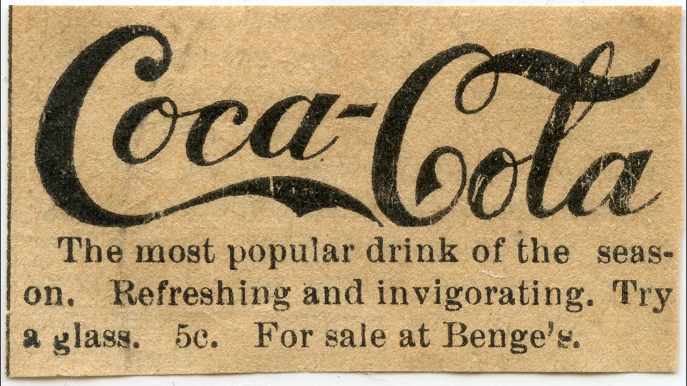

Marketing is a 321 billion dollar industry aimed at transforming human desire into dollars. Marketing professionals say they're introducing people to efficient ways of satisfying existing desires, but the way people repeatedly learn to ignore marketing [tactics](https://www.nngroup.com/articles/banner-blindness-old-and-new-findings/) is a strong indicator the industry is engaged in an extended struggle for attention.

In 1937 Elmer Wheeler, America's greatest salesman, debuted "Don’t Sell the Steak—Sell the Sizzle!", ending the era of letting clients know how much something cost and what features it has, and kickstarting the era of selling dreams.

Another hallmark of Wheeler's piches has aged less well: “Simple sentences, like simple people, get places.” Modern advertising is anything but simple, the specificity of data collection on the internet means it's profitable to make huge numbers of tiny changes to find an effective outcome. Decades ago Google tested [41 shades of blue](https://www.nytimes.com/2009/03/01/business/01marissa.html?pagewanted=print) to see what people liked clicking on the most. Now, they run [tens of thousands of A/B tests](https://hbr.org/2017/09/the-surprising-power-of-online-experiments) every year.

Even though about 50% of people say they ignore ads, the truth is there's something vitally important about advertising. Just like machine vision models can [be tricked by incorrect labels](https://www.theverge.com/2021/3/8/22319173/openai-machine-vision-adversarial-typographic-attacka-clip-multimodal-neuron), people who eat [identical products labelled differently](https://doi.org/10.1016/j.foodqual.2021.104491) will rate the flavor very differently. The human brain is a data condensation device that rates the option of other brains very highly.

https://hbr.org/2020/01/advertising-makes-us-unhappy

https://en.wikipedia.org/wiki/Thorstein_Veblen